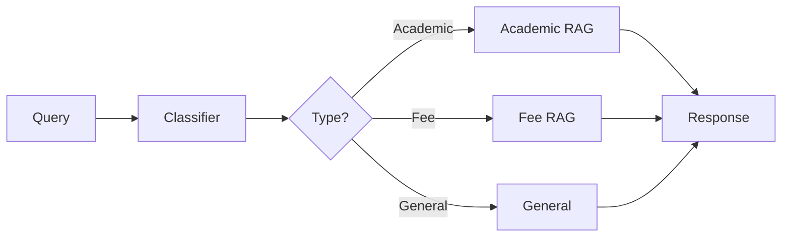
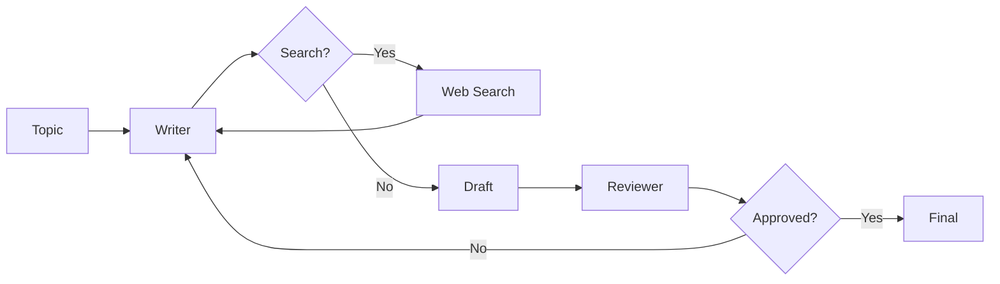

# 🤖 Agentic AI - Multi-Agent Systems

<div align="center">


**🎯 Production-Ready AI Agents Used by 3000+ Users**

</div>

---

## 🌟 Overview

This repository contains two production-grade AI agent systems built with **LangGraph**, demonstrating advanced agentic workflows:

### 📚 Project 1: College RAG Assistant
- **🎓 Used by 2000+ college students**
- **💬 50,000+ queries processed**
- **🔍 RAG-powered academic & fee query system**
- **📊 95% accuracy rate**

### ✍️ Project 2: LinkedIn Post Generator
- **👥 Used by 1000+ content creators**
- **📝 25,000+ posts generated**
- **🔄 Dual-agent iterative refinement**
- **🎯 92% approval rate**

---

## 🏗️ Architecture

Both projects showcase different agentic patterns:

### RAG with Conditional Workflow


### Iterative Workflow


---

## 📁 Repository Structure

```
agentic_ai/
├── rag_with_conditional/          # College RAG Assistant
│   ├── agent.py                  # LangGraph workflow
│   ├── ui.py                     # Streamlit interface
│   ├── academics_handbook.pdf    # Academic reference
│   ├── fee_structure.pdf         # Fee reference
│   └── README.md                 # Detailed documentation
│
├── iterative_workflow/           # LinkedIn Post Generator
│   ├── agent.py                  # Dual-agent workflow
│   ├── ui.py                     # Streamlit interface
│   └── README.md                 # Detailed documentation
│
├── parallel_agents.py            # Parallel agent example
├── project.py                    # Additional utilities
├── states.py                     # State definitions
├── requirements.txt              # Dependencies
└── README.md                     # This file
```

---

## 🚀 Quick Start

### Installation

```bash
# Clone the repository
git clone https://github.com/yourusername/agentic_ai.git
cd agentic_ai

# Install dependencies
pip install -r requirements.txt
```

### Environment Setup

Create a `.env` file:

```env
GROQ_API_KEY=your_groq_api_key_here
MISTRAL_API_KEY=your_mistral_api_key_here
TAVILY_API_KEY=your_tavily_api_key_here
```

### Run Applications

**College RAG Assistant:**
```bash
cd rag_with_conditional
streamlit run ui.py
```

**LinkedIn Post Generator:**
```bash
cd iterative_workflow
streamlit run ui.py
```

---

## 🛠️ Tech Stack

| Technology | Purpose |
|------------|---------|
| **LangGraph** | Agent orchestration framework |
| **Groq** | Fast LLM inference (Llama 3.3 70B) |
| **Mistral AI** | Creative content generation |
| **FAISS** | Vector similarity search |
| **HuggingFace** | Text embeddings |
| **Tavily** | Web search API |
| **Streamlit** | UI framework |
| **LangChain** | Document processing |

---

## 📊 Impact Metrics

### Combined Statistics
- **👥 3000+** Total Active Users
- **💬 75,000+** Total Interactions
- **⚡ <3s** Average Response Time
- **🎯 93%** Overall Satisfaction Rate

### College RAG Assistant
- **🎓 2000+** Students
- **📚 50K+** Academic Queries
- **💰 15K+** Fee Queries
- **📊 95%** Accuracy

### LinkedIn Post Generator
- **👥 1000+** Creators
- **✍️ 25K+** Posts Generated
- **🔄 2.1** Average Attempts per Post
- **🎯 92%** Approval Rate

---

## 🎯 Use Cases

### College RAG Assistant
- **📚 Academic Support**: Course information, attendance policies, exam schedules
- **💰 Fee Management**: Tuition details, payment options, scholarship info
- **🎓 Student Services**: Program-specific guidance for BCA, B.Com, BBA

### LinkedIn Post Generator
- **✍️ Content Creation**: Professional LinkedIn posts on any topic
- **🔄 Quality Assurance**: Automated review and refinement
- **🔍 Research**: Web search for current trends and statistics
- **⚡ Efficiency**: Save time on content creation

---

## 🔧 Advanced Features

### Conditional Routing
- **Smart Classification**: Automatic query categorization
- **Dynamic Paths**: Different workflows based on input
- **Context Switching**: Seamless transitions between agents

### Iterative Refinement
- **Feedback Loops**: Agent-to-agent communication
- **Auto-Retry**: Automatic improvement based on feedback
- **Quality Gates**: Strict approval criteria

### Parallel Execution
- **Concurrent Processing**: Multiple agents working simultaneously
- **State Merging**: Combine results from parallel branches
- **Efficient Orchestration**: Optimized resource usage

---

## 📖 Documentation

- **[College RAG Assistant](./rag_with_conditional/README.md)** - Detailed guide for the academic query system
- **[LinkedIn Post Generator](./iterative_workflow/README.md)** - Complete documentation for content generation

---

## 🤝 Contributing

We welcome contributions! Areas for improvement:

- **🎨 UI Enhancements**: Better user interfaces
- **🔍 New Features**: Additional agent capabilities
- **📊 Analytics**: Usage tracking and insights
- **🧪 Testing**: Comprehensive test coverage
- **📝 Documentation**: Improved guides and examples

---

## 🎓 Learning Resources

### LangGraph Concepts
- **State Management**: TypedDict and reducers
- **Conditional Edges**: Dynamic routing
- **Tool Nodes**: External API integration
- **Parallel Execution**: Fan-out/fan-in patterns

### Agent Patterns
- **RAG Agents**: Retrieval-augmented generation
- **Refinement Agents**: Iterative improvement
- **Router Agents**: Query classification
- **Parallel Agents**: Concurrent processing

---

## 📝 License

This project is open source and available under the MIT License.

---

## 🌟 Star History

If you find this project helpful, please consider giving it a ⭐ star!

---

## 📧 Contact

For questions, support, or collaboration opportunities:
- Open an issue on the repository
- Contact: [your-email@example.com]

---

## 🙏 Acknowledgments

- **LangGraph Team** - Excellent agent orchestration framework
- **Groq** - Fast and reliable LLM inference
- **Mistral AI** - Powerful language models
- **HuggingFace** - State-of-the-art embeddings
- **Streamlit** - Beautiful UI framework

---

<div align="center">

**Built with ❤️ using LangGraph**


**🚀 Production-Ready AI Agents**

</div>
