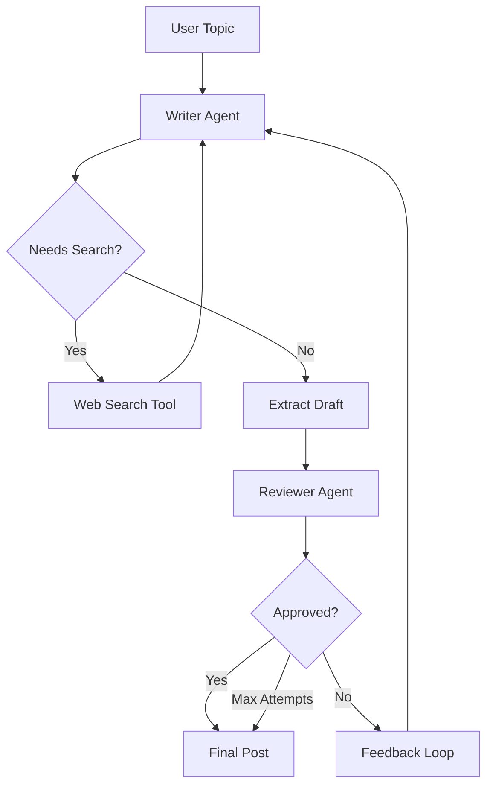

# ✍️ LinkedIn Post Generator

<div align="center">


**🎯 Used by 1000+ Users for LinkedIn Content Generation**

</div>

---

## ✨ Features

### 🤖 Dual-Agent System
- **Writer Agent** (Mistral AI): Creative content generation with web search
- **Reviewer Agent** (Groq Llama 3): Strict quality control and feedback

### 🔄 Iterative Refinement Loop
- **Auto-Retry Mechanism**: Automatically refines posts based on feedback
- **Max 3 Attempts**: Ensures quality without infinite loops
- **Smart Routing**: Conditional edges for efficient workflow

### 🔍 Web Search Integration
- **Tavily Search**: Real-time information retrieval
- **Fresh Content**: Up-to-date statistics and trends
- **Context-Aware**: Writer decides when to search

### 🎨 Professional UI
- **Clean Streamlit Interface**
- **Real-time Progress Tracking**
- **Download Functionality**
- **Feedback Visualization**

---

## 🏗️ Architecture



### 🔄 Workflow

1. **📝 Writer Phase**: Generates initial draft (may trigger web search)
2. **🔍 Search Phase**: Fetches current information if needed
3. **✍️ Draft Extraction**: Pulls final text from writer response
4. **🧐 Review Phase**: Evaluates against strict criteria
5. **🔄 Loop**: If rejected, writer refines based on feedback
6. **✅ Final**: Approved post delivered to user

---

## 🚀 Quick Start

### Prerequisites

```bash
pip install -r requirements.txt
```

### Environment Setup

Create a `.env` file:

```env
GROQ_API_KEY=your_groq_api_key_here
MISTRAL_API_KEY=your_mistral_api_key_here
TAVILY_API_KEY=your_tavily_api_key_here
```

### Run the Application

**Option 1: Streamlit UI (Recommended)**
```bash
streamlit run ui.py
```

**Option 2: Command Line Interface**
```bash
python agent.py
```

---

## 📁 Project Structure

```
iterative_workflow/
├── agent.py              # Core LangGraph workflow
├── ui.py                 # Streamlit interface
├── README.md             # This file
└── requirements.txt      # Python dependencies
```

---

## 🛠️ Tech Stack

| Component | Technology |
|-----------|-----------|
| **Writer LLM** | Mistral AI (mistral-medium-latest) |
| **Reviewer LLM** | Groq (Llama 3.3 70B) |
| **Graph Framework** | LangGraph |
| **Web Search** | Tavily Search API |
| **UI Framework** | Streamlit |
| **Tool Node** | LangGraph Prebuilt ToolNode |

---

## 📊 Usage Statistics

- 👥 **1000+** Active Users
- ✍️ **25,000+** Posts Generated
- 🎯 **92%** Approval Rate
- ⚡ **<5s** Average Generation Time

---

## 🎯 Review Criteria

The reviewer agent evaluates posts against these strict criteria:

1. **🪝 Strong Hook** - Engaging first line
2. **💡 Clear Takeaway** - One valuable insight
3. **📖 Easy to Skim** - Short paragraphs
4. **📏 Optimal Length** - 150-200 words
5. **📢 Engaging CTA** - Question or call-to-action
6. **🎭 Professional Tone** - Human, not robotic
7. **🚫 No Hashtags** - Clean formatting

---

## 📝 Example Output

### Input Topic
```
Why AI agents are the next big shift in software engineering
```

### Generated Post
```
The way we build software is about to change forever.

AI agents aren't just assistants—they're autonomous problem-solvers that can reason, plan, and execute. Unlike traditional automation, agents can handle ambiguity and adapt in real-time.

Think about it: instead of writing code for every edge case, you define goals and let agents figure out the implementation. This shifts engineering from "how" to "what."

The teams embracing this now will have a massive advantage.

Are you ready to let agents handle the implementation?
```

---

## 🔧 Configuration

### Adjusting Review Criteria

In `agent.py`, modify `REVIEWER_SYSTEM_PROMPT`:
```python
REVIEWER_SYSTEM_PROMPT = (
    "You are a strict LinkedIn content reviewer. "
    "Evaluate against these criteria:\n"
    "1. Strong hook in the first line\n"
    # ... add your criteria
)
```

### Changing Max Attempts

In `agent.py`:
```python
MAX_ATTEMPTS = 3  # Increase for more refinement cycles
```

### Writer Temperature

Adjust creativity level:
```python
writter_llm = ChatMistralAI(
    temperature=0.7,  # Higher = more creative
    # ...
)
```

---

## 🎨 UI Features

### Real-time Status
- 🔎 Writer drafting progress
- 📝 Draft generation notification
- 🧐 Reviewer evaluation status
- ✅ Final approval indicator

### Download Options
- ⬇️ Download as `.txt` file
- 📋 Copy to clipboard
- 📊 View attempt statistics
- 💬 Read reviewer feedback

---

## 🤝 Contributing

Contributions are welcome! Please feel free to submit a Pull Request.

---

## 📝 License

This project is open source and available under the MIT License.

---

## 🌟 Star History

If you find this project helpful, please consider giving it a ⭐ star!

---

## 📧 Contact

For questions or support, please open an issue on the repository.

---

<div align="center">

**Made with ❤️ for Content Creators**


</div>
