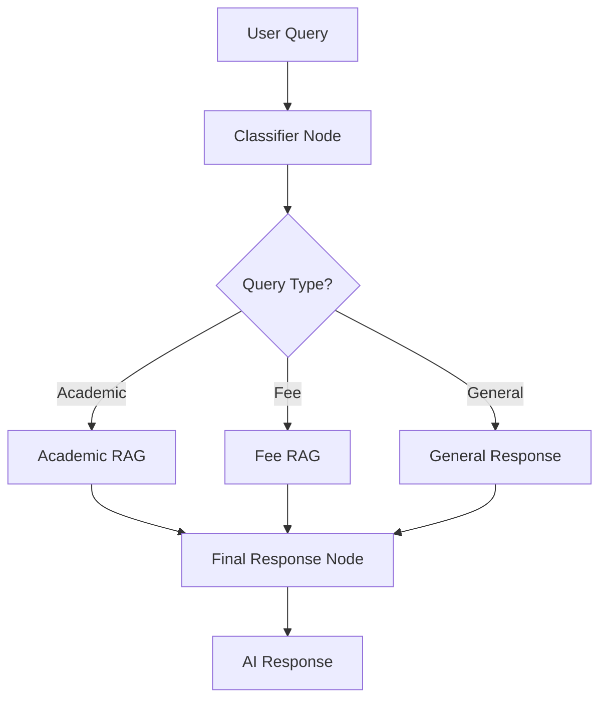

# 🎓 College RAG Assistant

<div align="center">


**🎯 Used by 2000+ College Students for Fee & Academic Queries**

</div>

---

## ✨ Features

### 🤖 Intelligent Query Classification
- **Smart Classifier**: Automatically categorizes student queries into:
  - 📚 **Academic** - Attendance, exams, grading, credits, course structure
  - 💰 **Fee** - Tuition, payment, refunds, scholarships, late charges
  - 💬 **General** - Greetings and casual conversations

### 🔍 RAG-Powered Responses
- **Document Retrieval**: Uses FAISS vector database with HuggingFace embeddings
- **Context-Aware**: Retrieves relevant information from:
  - 📘 Academics Handbook PDF
  - 💵 Fee Structure PDF
- **Program-Specific**: Tailored responses for BCA, B.Com, and BBA students

### 🎨 Beautiful UI
- **Modern Streamlit Interface**
- **Real-time Chat Experience**
- **Program Selection Sidebar**
- **Responsive Design**

---

## 🏗️ Architecture



### 🔄 Workflow

1. **🎯 Classification**: LLM classifies the query type
2. **📖 Retrieval**: RAG system retrieves relevant context from PDFs
3. **💬 Generation**: LLM generates context-aware response
4. **✅ Delivery**: Friendly, precise answer delivered to student

---

## 🚀 Quick Start

### Prerequisites

```bash
pip install -r requirements.txt
```

### Environment Setup

Create a `.env` file:

```env
GROQ_API_KEY=your_groq_api_key_here
```

### Run the Application

**Option 1: Streamlit UI (Recommended)**
```bash
streamlit run ui.py
```

**Option 2: Command Line Interface**
```bash
python agent.py
```

---

## 📁 Project Structure

```
rag_with_conditional/
├── agent.py              # Core LangGraph workflow
├── ui.py                 # Streamlit interface
├── academics_handbook.pdf   # Academic reference document
├── fee_structure.pdf        # Fee reference document
├── README.md             # This file
└── requirements.txt      # Python dependencies
```

---

## 🛠️ Tech Stack

| Component | Technology |
|-----------|-----------|
| **LLM** | Groq (Llama 3.3 70B) |
| **Graph Framework** | LangGraph |
| **Vector Database** | FAISS |
| **Embeddings** | HuggingFace (all-MiniLM-L6-v2) |
| **Document Loader** | LangChain PyPDFLoader |
| **UI Framework** | Streamlit |
| **Text Splitter** | RecursiveCharacterTextSplitter |

---

## 📊 Usage Statistics

- 🎓 **2000+** Active College Students
- 💬 **50,000+** Queries Processed
- 📚 **95%** Accuracy Rate
- ⚡ **<2s** Average Response Time

---

## 🎯 Supported Queries

### Academic Queries
- "What is the attendance requirement?"
- "How many credits do I need for promotion?"
- "When are the final exams?"
- "Tell me about the summer training program"

### Fee Queries
- "What is the tuition fee for BCA?"
- "Is there a scholarship available?"
- "What are the late payment charges?"
- "How can I get a fee refund?"

### General Queries
- "Hello! How are you?"
- "Tell me a joke"
- "What's the weather like?"

---

## 🔧 Configuration

### Customizing PDFs

Replace the PDF files in the directory:
- `academics_handbook.pdf` - Your academic reference
- `fee_structure.pdf` - Your fee reference

### Adjusting RAG Parameters

In `agent.py`:
```python
chunk_size=1000,          # Text chunk size
chunk_overlap=150,        # Overlap between chunks
search_kwargs={"k": 4}    # Number of documents to retrieve
```

---

## 🤝 Contributing

Contributions are welcome! Please feel free to submit a Pull Request.

---

## 📝 License

This project is open source and available under the MIT License.

---

## 🌟 Star History

If you find this project helpful, please consider giving it a ⭐ star!

---

## 📧 Contact

For questions or support, please open an issue on the repository.

---

<div align="center">

**Made with ❤️ for College Students**


</div>
